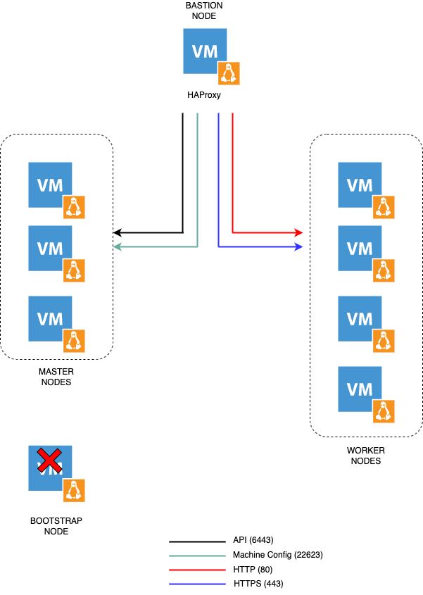

# okd-upi-install

This repository provides the configurations in order to install OKD or Red Hat OpenShift through KVM (libvirt).

The folders **fcos** and **rhcos** contain respectively the scripts for installing OKD (Fedora CoreOS) and Red Hat Openshift (Red Hat Linux CoreOS). 

### Prerequisites - Variables

In order to perform Day2 specific actions regarding authentication, persistent storage for the internal image register, it will therefore be necessary to inject environment variables. It's best to reference all the variables so you don't forget anything.

Here is below the exhaustive list: 

- `HTPASSWD_SECRET`: htpasswd secret [base64]
- `HTPASSWD_SECRET_NAME`: name of the secret
- `REGISTRY_PV_NAME`: name of the persistent volume 

# OpenShift 4 Install - User Provisioned Infrastructure (UPI)

#### Architecture diagram

Information 
- Cluster name: caas
- Base Domain: eazytraining.lab 

