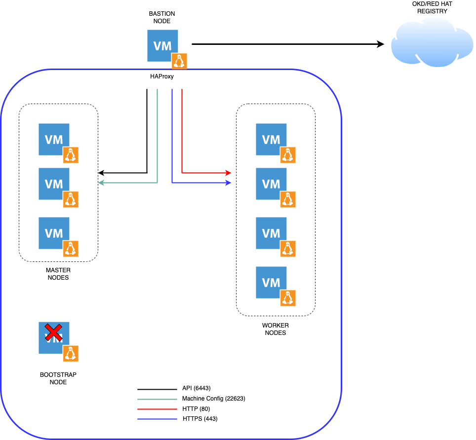

# okd-upi-install

This repository provides the configurations in order to install OKD through KVM (libvirt).


### Prerequisites - Variables

In order to perform Day2 specific actions regarding authentication and persistent storage for the internal image register, it will therefore be necessary to inject environment variables. It's best to reference all the variables so you don't forget anything.

Here is below the exhaustive list: 

- `CLUSTER_NAME`: name of the cluster [caas]
- `HTPASSWD_SECRET`: htpasswd secret [base64]
- `HTPASSWD_SECRET_NAME`: name of the secret
- `REGISTRY_PV_NAME`: name of the persistent volume 
- `NFS_MONITORING_SIZE`: size of the storage used by the monitoring stack [XXGi]


# OpenShift 4 Install - User Provisioned Infrastructure (UPI)

## Architecture diagram
***

###### Information 
- Cluster name: caas
- Base Domain: eazytraining.lab 



**OKD VMs**
|          VM             |  CPU | Memory |     OS            |    IP Address         | Disk (GB) |
|-------------------------|------|--------|-------------------|-----------------------|-----------|
|     Bastion             |   4  |    4   |  Alma Linux 8.7   |  192.168.110.9        |     420   |
|     Master-[1-3]        |   6  |    10  |  Fedora CoreOS 37 |  192.168.110.[111-113]|     60    |
|     Worker-[1-4]        |   8  |    12  |  Fedora CoreOS 37 |  192.168.110.[114-117]|     60    | 
|     Bootstrap           |   4  |    8   |  Fedora CoreOS 37 |  192.168.110.110      |     40    |


## Download Software
***

1. Download [Alma Linux 8.7](http://mirror.almalinux.ikoula.com/8.7/isos/x86_64/AlmaLinux-8.7-x86_64-minimal.iso) for installing the bastion node
2. Download the following files
    -  [FCOS 37 Build 37.20230205.3.0](https://builds.coreos.fedoraproject.org/browser?stream=stable&arch=x86_64)
        - [kernel](https://builds.coreos.fedoraproject.org/prod/streams/stable/builds/37.20230205.3.0/x86_64/fedora-coreos-37.20230205.3.0-live-kernel-x86_64)
        - [initramfs](https://builds.coreos.fedoraproject.org/prod/streams/stable/builds/37.20230205.3.0/x86_64/fedora-coreos-37.20230205.3.0-live-initramfs.x86_64.img)
        - [rootfs](https://builds.coreos.fedoraproject.org/prod/streams/stable/builds/37.20230205.3.0/x86_64/fedora-coreos-37.20230205.3.0-live-rootfs.x86_64.img)
    
3. Login to [Red Hat OpenShift Cluster Manager](https://cloud.redhat.com/openshift) to download the Pull Secret
4. Select 'Create Cluster' from the 'Clusters' navigation menu
5. Select 'RedHat OpenShift Container Platform
6. Select 'Run on Bare Metal'
7. Download the Pull Secret


## Prepare the environment for installing OKD 4.10
**In KVM Hypervisor**

All the below commands should be performed by using the root account. 

1. Install the KVM Hypervisor

Install all the dependencies 
```sh 
dnf install qemu-kvm libvirt libvirt-python3 jq libguestfs-tools virt-install vim git curl wget firewalld NetworkManager-tui -y
```

Enable and start the service
```sh
systemctl enable libvirtd && systemctl start libvirtd && systemctl status libvirtd
systemctl enable firewalld && systemctl start firewalld && systemctl status firewalld
```


2. Create the **ocpnet** network in KVM
```sh
mkdir ~/ocp && cd ocp
cat <<EOF  | tee ocpnet.xml
<network>
  <name>ocpnet</name>
  <forward mode='nat' dev='enp4s0'/>
  <bridge name='ocpnet'/>
  <ip address='192.168.110.1' netmask='255.255.255.0'>
  </ip>
</network>
EOF
```

```sh
virsh net-define ocpnet.xml
virsh net-list --all
virsh net-autostart ocpnet
virsh net-start ocpnet
virsh net-list --all
virsh net-destroy default
virsh net-undefine default
systemctl restart libvirtd
```

3. Configure the network interfaces and the firewall 
```sh
nmcli connection modify ocpnet connection.zone internal
nmcli connection modify 'System enp4s0' connection.zone public
firewall-cmd --get-active-zones
firewall-cmd --zone=internal --add-masquerade --permanent
firewall-cmd --zone=public --add-masquerade --permanent
firewall-cmd --reload
firewall-cmd --list-all --zone=internal
firewall-cmd --list-all --zone=public
```

4. Download the Alma Linux 8.7 iso image to the dedicated pool on the host server. <br>
```sh
mkdir -p /var/lib/libvirt/pool/ssd/iso && cd /var/lib/libvirt/pool/ssd/iso
wget http://mirror.almalinux.ikoula.com/8.7/isos/x86_64/AlmaLinux-8.7-x86_64-minimal.iso
```

5. Create the Bastion node server and install Alma Linux 8.7
```sh 
qemu-img create -o preallocation=metadata -f qcow2 /var/lib/libvirt/pool/ssd/bastion.eazytraining.lab.qcow2 200G
```

```sh
virt-install --virt-type kvm --name bastion --ram 4192 --vcpus=4 \
   --disk /var/lib/libvirt/pool/ssd/bastion.eazytraining.lab.qcow2,format=qcow2 \
   --network network=ocpnet \
   --os-type=linux --os-variant=almalinux8 \
   --location=/var/lib/libvirt/pool/ssd/iso/AlmaLinux-8.7-x86_64-minimal.iso \
   --graphics none \
   --console pty,target_type=serial \
   --extra-args 'console=ttyS0,115200n8 serial'
```

## Configure Environmental Services

1. SSH to the Bastion server

2. Update Alma Linux and install required dependencies 
```sh 
dnf update
dnf install -y bind bind-utils dhcp-server httpd haproxy nfs-utils chrony vim jq wget git
```

3. Download Client and Installer tools  
```sh 
mkdir -p ~/ocp && cd ocp
wget https://github.com/okd-project/okd/releases/download/4.12.0-0.okd-2023-03-05-022504/openshift-client-linux-4.12.0-0.okd-2023-03-05-022504.tar.gz -O openshift-client-linux.tar.gz
wget https://github.com/okd-project/okd/releases/download/4.12.0-0.okd-2023-03-05-022504/openshift-install-linux-4.12.0-0.okd-2023-03-05-022504.tar.gz -O openshift-install-linux.tar.gz
```

4. Extract Client and Installer tools and move them to /usr/local/bin
```sh 
# Client tools
tar xvf openshift-client-linux.tar.gz
mv oc kubectl /usr/local/bin

# Installer
tar xvf openshift-install-linux.tar.gz
mv openshift-install /usr/local/bin
```

5. Confirm Client and Installer tools are working 
```sh 
kubectl version --client --short
oc version
openshift-install version
```


6. Download [config files](https://github.com/ObieBent/okd-upi-install) for each of the services
```sh
cd ~
git clone https://github.com/ObieBent/okd-upi-install.git
```

7. Configure BIND DNS

Apply configuration 
```sh
cp -f ~/okd-upi-install/dns/named.conf /etc/named.conf
cp -R ~/okd-upi-install/dns/zones /etc/named
```
  
Configure the firewall for DNS
```sh
firewall-cmd --add-port=53/tcp --permanent
firewall-cmd --reload
```

Enable and start the service 
```sh 
systemctl enable --now named
systemctl start named 
systemctl status named
```

Confirm dig now sees the correct DNS results by using the DNS server running locally 
```sh 
dig eazytraining.lab @127.0.0.1
dig -x 192.168.110.9 @127.0.0.1
```

Change the nameserver configured in the `/etc/resol.conf` by 127.0.0.1

8. Configure DHCP

Copy the conf file to the correct location for the DHCP service to use 
```sh
cp ~/okd-upi-install/dhcp/dhcpd.conf /etc/dhcp/dhcpd.conf
```

Configure the firewall 
```sh 
firewall-cmd --add-service=dhcp --permanent 
firewall-cmd --reload
```

Enable and start the service 
```sh 
systemctl enable --now dhcpd
systemctl start dhcpd 
systemctl status dhcpd
```

9. Configure the Apache Web Server 

Change default listen port to 8080 in httpd.conf
```sh
sed -i 's/Listen 80/Listen 0.0.0.0:8080/' /etc/httpd/conf/httpd.conf
```

Configure the firewall for Web Server traffic 
```sh
firewall-cmd --add-port=8080/tcp --permanent
firewall-cmd --reload
```

Enable and start the service 
```sh 
systemctl enable --now httpd
systemctl start httpd 
systemctl status httpd
```

Making a GET request to localhost on port 8080 should now return the default Apache webpage
```sh 
curl localhost:8080
```

10. Configure HAProxy 

Copy HAProxy config 
```sh
cp -f ~/okd-upi-install/haproxy/haproxy.cfg /etc/haproxy/haproxy.cfg
```

Configure the firewall 
```sh
firewall-cmd --add-port=9000/tcp
firewall-cmd --add-port=6443/tcp --zone=public --permanent # kube-api-server on control plane nodes
firewall-cmd --add-port=22623/tcp --zone=public --permanent # machine-config server
firewall-cmd --add-service=http --zone=public --permanent # web services hosted on worker nodes
firewall-cmd --add-service=https --zone=public --permanent # web services hosted on worker nodes
```

Enable and start the service 
```sh 
setsebool -P haproxy_connect_any 1 # SELinux name_bind access
systemctl enable --now haproxy
systemctl start haproxy 
systemctl status haproxy
```

11. Configure NFS for the OpenShift registry. It is a requirement to provide storage to the Registry, empyDir can be specified if necessary. 

Create the Share 

Check available disk and its location `df -h`

```sh
dnf install nfs-utils -y
mkdir -p /shares/{registry,data}
chown -R nobody:nobody /shares/
chmod -R 777 /shares/
```

Export the Share 
```sh 
echo "/shares 192.168.110.0/24(rw,sync,root_squash,no_subtree_check,no_wdelay)" > /etc/exports
exportfs -rv
```

Set firewall rules 
```sh 
firewall-cmd --zone=public --add-service mountd --permanent
firewall-cmd --zone=public --add-service rpc-bind --permanent
firewall-cmd --zone=public --add-service nfs --permanent
firewall-cmd --reload
```

Enable and start the NFS related services 
```sh
systemctl enable --now nfs-server rpcbind
systemctl start nfs-server rpcbind nfs-mountd
```

12. Configure NTP Server 
Set the NTP server 
```sh 
vim /etc/chrony.conf

# comment below line
# pool 2.almalinux.pool.ntp.org iburst

# add below lines
# Europe NTP servers
server 0.europe.pool.ntp.org
server 1.europe.pool.ntp.org
server 2.europe.pool.ntp.org
server 3.europe.pool.ntp.org

# Modify below line 
# Allow NTP client access from local network 
allow 192.168.110.0/24
```

Enable and start the NTP service
```sh
systemctl enable --now chronyd
systemctl start chronyd
systemctl status chronyd
```

Verify NTP Server 
```sh
chronyc sources
```

Allow remote access to NTP server
```sh 
firewall-cmd --permanent --add-service=ntp
firewall-cmd --reload
```

## Generate and host install files 
1. Generate an SSH key pair
```sh
ssh-keygen -t rsa -b 4096 -N "" -f /root/.ssh/id_rsa
```

2. Create an install directory
```sh 
mkdir ~/ocp-install
```

3. Copy the install-config.yaml included in the cloned repository to the install directory
```sh 
cp ~/okd-upi-install/manifests/install-config.yaml ~/ocp-install/
```

4. Update the install-config yaml with your own pull-secret and ssh key.
  - Line 23 should contain the contents of your pull-secret.txt obtained from [Red Hat Cluster Manager](https://cloud.redhat.com/openshift/install)
  - Line 24 should contain the contents of your '~/.ssh/id_rsa.pub'
```sh
vim ~/ocp-install/install-config.yaml
```

5. Generate Kubernetes manifest files
```sh
openshift-install create manifests --dir ~/ocp-install
```

>Above warning message says that master nodes are schedulable, it means we can have workload on control planes (control planes will also work as worker nodes). If you wish to disable this then run following sed command,
```sh
sed -i 's/mastersSchedulable: true/mastersSchedulable: false/' ~/ocp-install/manifests/cluster-scheduler-02-config.yml
```

Generate the Ignition config and Kubernetes auth files 
```sh
openshift-install create ignition-configs --dir ~/ocp-install/
```

6. Create a hosting directory to serve the configuration files for the OpenShift booting process
```sh
mkdir -p /var/www/html/ocp4
```

7. Copy all generated install files to the new web server directory 
```sh 
cp -R ~/ocp-install/*.ign /var/www/html/ocp4/
```

8. Move the Fedora Core OS image to the web server directory
```sh 
mkdir -p /var/www/html/okd4-image
wget https://builds.coreos.fedoraproject.org/prod/streams/stable/builds/37.20230205.3.0/x86_64/fedora-coreos-37.20230205.3.0-live-kernel-x86_64 -O /var/www/html/okd4-image/fcos-37-vmlinuz
wget https://builds.coreos.fedoraproject.org/prod/streams/stable/builds/37.20230205.3.0/x86_64/fedora-coreos-37.20230205.3.0-live-initramfs.x86_64.img -O /var/www/html/okd4-image/fcos-37-initramfs.img
wget https://builds.coreos.fedoraproject.org/prod/streams/stable/builds/37.20230205.3.0/x86_64/fedora-coreos-37.20230205.3.0-live-rootfs.x86_64.img -O /var/www/html/okd4-image/fcos-37-rootfs.img
```

9. Create the .treeinfo file which will be used as a helper for installing the OS
```sh 
cat <<EOF > /var/www/html/okd4-image/.treeinfo
[general]
arch = x86_64
family = Fedora CoreOS
platforms = x86_64
version = 4.12
[images-x86_64]
initrd = fcos-37-initramfs.img
kernel = fcos-37-vmlinuz
EOF
```

10. Change ownership and permissions of the web server directory
```sh
# OS
chcon -R -t httpd_sys_content_t /var/www/html/okd4-image
chown -R apache: /var/www/html/okd4-image
chmod 744 -R /var/www/html/okd4-image/

# Ignition files
chcon -R -t httpd_sys_content_t /var/www/html/ocp4/
chown -R apache: /var/www/html/ocp4/
chmod 744 -R /var/www/html/ocp4/
```

11. Confirm you can see all files added to the /var/www/html/ocp4/ and /var/www/htlm/okd4-image/ dirs through Apache
```sh
curl localhost:8080/ocp4/
curl localhost:8080/okd4-image/
```

## Deploy OpenShift

1. Deploy the bootstrap host and the control plane hosts 
 
**From the KVM Hypervisor**

Clone the repository
```sh
git clone https://github.com/ObieBent/okd-upi-install.git
```

###### Open four terminal

```sh
cd okd-upi-install
```

1st terminal
```sh 
sh fcos/control-plane/deployBootstrap.sh
```

2nd terminal
```sh 
sh fcos/control-plane/deployMaster01.sh
```

3rd terminal
```sh 
sh fcos/control-plane/deployMaster02.sh
```

4th terminal
```sh 
sh fcos/control-plane/deployMaster03.sh
```

## Monitor the Bootstrap Process
**From the Bastion host**
1. You can monitor the bootstrap process from the ocp-svc host at different log levels (debug, error, info)
```sh 
openshift-install --dir ~/ocp-install wait-for bootstrap-complete --log-level=debug
```

2. Once bootstrapping is complete the ocp-bootstrap node [can be removed](https://github.com/ObieBent/okd-upi-install#remove-the-bootstrap-node)


## Remove the Boostrap Node
1. Remove all references to the ocp-bootstrap host from the /etc/haproxy/haproxy.cfg file 
```sh 
# Two entries
vim /etc/haproxy/haproxy.cfg
# Restart HAProxy
systemctl restart haproxy
```

2. The ocp-bootstrap host can now be safely shutdown and deleted.
```sh
sh ~/okd-upi-install/cleanup-bootstrap.sh 
```

## Wait for installation to complete
1. Collect the OpenShift Console address and kubeadmin credentials from the output to the install-complete event
```sh
openshift-install --dir ~/ocp-install wait-for install-complete --log-level=debug
```
2. Continue to join the worker nodes to the cluster in a new tab whilst waiting for the above command to complete


## Join Worker Nodes

1. Setup 'oc' and 'kubectl' clients on the ocp-svc machine
```sh 
export KUBECONFIG=~/ocp-install/auth/kubeconfig
# Test auth by viewing cluster nodes
oc get nodes
```

2. View and approve pending CSRs 
```sh
# View CSRs
oc get csr
# Approve all pending CSRs
oc get csr -o go-template='{{range .items}}{{if not .status}}{{.metadata.name}}{{"\n"}}{{end}}{{end}}' | xargs oc adm certificate approve
# Wait for kubelet-serving CSRs and approve them too with the same command
oc get csr -o go-template='{{range .items}}{{if not .status}}{{.metadata.name}}{{"\n"}}{{end}}{{end}}' | xargs oc adm certificate approve
```
3. Watch and wait for the Worker Nodes to join the cluster and enter a 'Ready' status

>This can take 5-10 minutes
```sh
watch -n5 oc get nodes
```

## Configure storage for the Image Registry
1. Clone the CSI driver repository required in order to consume NFS volumes

```sh 
mkdir ~/ocp/nfs -p && cd ~/ocp/nfs
git clone https://github.com/kubernetes-sigs/nfs-subdir-external-provisioner.git k8s-csi-nfs 
cd k8s-csi-nfs 
```

2. Create namespace for NFS Storage provisioner
```sh
oc create namespace openshift-nfs-storage
```

3. Add monitoring label to namespace
```sh 
oc label namespace openshift-nfs-storage "openshift.io/cluster-monitoring=true"
```

4. Configure deployment and RBAC for NFS <br>

Switch project 
```sh
oc project openshift-nfs-storage
```

Change namespace on deployment and rbac YAML file
```sh
NAMESPACE=`oc project -q`

sed -i'' "s/namespace:.*/namespace: $NAMESPACE/g" ./deploy/rbac.yaml 
sed -i'' "s/namespace:.*/namespace: $NAMESPACE/g" ./deploy/deployment.yaml
```

Create RBAC
```sh
oc create -f deploy/rbac.yaml
oc adm policy add-scc-to-user hostmount-anyuid system:serviceaccount:$NAMESPACE:nfs-client-provisioner
```

Configure deployment
```sh
vim ~/ocp/nfs/k8s-csi-nfs/deploy/deployment.yaml
```

```yaml 
apiVersion: apps/v1
kind: Deployment
metadata:
  name: nfs-client-provisioner
  labels:
    app: nfs-client-provisioner
  # replace with namespace where provisioner is deployed
  namespace: openshift-nfs-storage
spec:
  replicas: 1
  strategy:
    type: Recreate
  selector:
    matchLabels:
      app: nfs-client-provisioner
  template:
    metadata:
      labels:
        app: nfs-client-provisioner
    spec:
      serviceAccountName: nfs-client-provisioner
      containers:
        - name: nfs-client-provisioner
          image: quay.io/external_storage/nfs-client-provisioner:latest
          volumeMounts:
            - name: nfs-client-root
              mountPath: /persistentvolumes
          env:
            - name: PROVISIONER_NAME
              value: storage.io/nfs
            - name: NFS_SERVER
              value: 10.10.51.9           # Change this (NFS IP Server )
            - name: NFS_PATH
              value: /mnt/nfs_shares/okd  # Change this (NFS mount path)
      volumes:
        - name: nfs-client-root
          nfs:
            server: 10.10.51.9            # Change this (NFS IP Server)
            path: /mnt/nfs_shares/okd     # Change this (NFS mount path)
```

Configure storageclass
```sh
vim ~/ocp/nfs/k8s-csi-nfs/deploy/class.yaml
```

```yaml
apiVersion: storage.k8s.io/v1
kind: StorageClass
metadata:
  name: nfs-sc
provisioner: storage.io/nfs # or choose another name, must match deployment's env PROVISIONER_NAME'
parameters:
  archiveOnDelete: "false"
```

Deploy Deployment and StorageClass
```sh
oc create -f ~/ocp/nfs/k8s-csi-nfs/deploy/class.yaml 
oc create -f ~/ocp/nfs/k8s-csi-nfs/deploy/deployment.yaml
```

Verify deployment
```sh
oc get pods -n openshift-nfs-storage
```

1. Create the 'image-registry-storage' PVC by updating the Image Registry operator config by updating the management state to 'Managed' and adding 'pvc' and 'claim' keys in the storage key:

```sh
oc edit configs.imageregistry.operator.openshift.io
```

```sh
managementState: Managed
```

```sh 
storage:
  pvc:
    claim: # leave the claim blank
```

2. Confirm the 'image-registry-storage' pvc has been created and is currently in a 'Pending' state
```sh 
oc get pvc -n openshift-image-registry
```

3. Create the persistent volume for the 'image-registry-storage' pvc to bind to
```sh
export REGISTRY_PV_NAME=registry-pv
cat ~/okd-upi-install/manifests/registry-pv.yaml | envsubst | oc create -f -
```

4. After a short wait the 'image-registry-storage' pvc should now be bound
```sh
oc get pvc -n openshift-image-registry
```

5. Set default storageclass

```sh
oc patch storageclass nfs-sc -p '{"metadata": {"annotations": {"storageclass.kubernetes.io/is-default-class": "true"}}}'
```

6. Check clusteroperator status. Wait until Availability become True.
```sh
oc get clusteroperator image-registry
```


## Access the OpenShift Console
1. Wait for the 'console' Cluster Operator to become available
```sh 
oc get co
```

2. Append the following to your local workstations /etc/hosts file:
> From your local workstation If you do not want to add an entry for each new service made available on OpenShift you can configure the ocp-svc DNS server to serve externally and create a wildcard entry for *.apps.caas.eazytraining.lab

```sh
# Open the hosts file
sudo vi /etc/hosts

# Append the following entries:
192.168.110.9 bastion api.caas.eazytraining.lab console-openshift-console.apps.caas.eazytraining.lab oauth-openshift.apps.caas.eazytraining.lab downloads-openshift-console.apps.caas.eazytraining.lab alertmanager-main-openshift-monitoring.apps.caas.eazytraining.lab grafana-openshift-monitoring.apps.caas.eazytraining.lab prometheus-k8s-openshift-monitoring.apps.caas.eazytraining.lab thanos-querier-openshift-monitoring.apps.caas.eazytraining.lab
```

3. Navigate to the OpenShift Console URL and log in as the 'username' user

>You will get self signed certificate warnings that you can ignore If you need to login as kubeadmin and need to the password again you can retrieve it with: cat ~/ocp-install/auth/kubeadmin-password


## Day 2 Gestures

### Create the first Admin user
1. Apply the `oauth-htpasswd.yaml` file to the cluster

```sh
export HTPASSWD_SECRET_NAME=htpasswd-secret
export HTPASSWD_SECRET=`htpasswd -n -B -b <username> <password> | base64 -w0`
cat ~/okd-upi-install/manifests/oauth-htpasswd.yaml | envsubst | oc apply -f - 
```

2. Assign the new user admin permissions
```sh
oc adm policy add-cluster-role-to-user cluster-admin <username>
```


### Infra Nodes Configuration 
1. Adding the label `node-role.kubernetes.io/infra`
```sh 
oc  label node ocp-worker-01.caas.eazytraining.lab node-role.kubernetes.io/infra=
oc  label node ocp-worker-02.caas.eazytraining.lab node-role.kubernetes.io/infra=
oc  label node ocp-worker-03.caas.eazytraining.lab node-role.kubernetes.io/infra=
```

2. Define the machine config pool configuration 
```sh
mkdir ~/ocp/infra-nodes 
```

```sh
cat <<EOF | sudo tee  ~/ocp/infra-nodes/mcp.yaml
apiVersion: machineconfiguration.openshift.io/v1
kind: MachineConfigPool
metadata:
  name: infra
spec:
  machineConfigSelector:
    matchExpressions:
      - {key: machineconfiguration.openshift.io/role, operator: In, values: [worker,infra]}
  nodeSelector:
    matchLabels:
      node-role.kubernetes.io/infra: ""
EOF
```

3. Apply the machine config pool configuration
```sh
oc apply -f ~/ocp/infra-nodes/mcp.yaml
```

4. Check if it is well applied to the nodes specified in step 1 

```sh
watch -n2 oc get mcp
```

5. Schedule the ingress controller pods on infra nodes 
```sh 
oc edit ingresscontrollers.operator.openshift.io -n openshift-ingress-operator
```

```sh 
spec: 
  nodePlacement:
    nodeSelector:
      matchLabels:
        node-role.kubernetes.io/infra: ""
```

Verify if ingress controller pods are running on infra nodes 
```sh 
oc get pod -n openshift-ingress -o wide
```

6. Schedule the image registry pods on infra nodes
```sh
oc edit configs.imageregistry.operator.openshift.io
```

```sh
spec:
 nodeSelector:
   node-role.kubernetes.io/infra: ""
```

Verify if image registry pods are running on infra nodes
```sh 
oc get po -n openshift-image-registry  -owide
```

7. Define taints on infra node to prevent the scheduling of application workloads

```sh
oc adm taint node  ocp-worker-01.caas.eazytraining.lab node-function=infra:NoSchedule
oc adm taint node  ocp-worker-02.caas.eazytraining.lab node-function=infra:NoSchedule
oc adm taint node  ocp-worker-03.caas.eazytraining.lab node-function=infra:NoSchedule
```

Reboot nodes
```sh 
ssh core@ocp-worker-01.caas.eazytraining.lab -t 'sudo reboot'
ssh core@ocp-worker-02.caas.eazytraining.lab -t 'sudo reboot'
ssh core@ocp-worker-03.caas.eazytraining.lab -t 'sudo reboot'
```

8. Remove label node-role.kubernetes.io/worker
```sh
oc  label node ocp-worker-01.caas.eazytraining.lab node-role.kubernetes.io/worker-
oc  label node ocp-worker-02.caas.eazytraining.lab node-role.kubernetes.io/worker-
oc  label node ocp-worker-03.caas.eazytraining.lab node-role.kubernetes.io/worker-
```

### Monitoring
1. Define the scheduling of the monitoring stack pods on Infra Nodes at the cluster level and the required size on the storage

```sh 
export CLUSTER_NAME=caas
export NFS_MONITORING_SIZE=20Gi
cat ~/okd-upi-install/manifests/monitoring-cluster.yaml | envsubst | oc apply -f - 
```

2. Enable monitoring for user-defined projects on Infra Nodes
```sh 
oc apply -f ~/okd-upi-install/manifests/monitoring-user.yaml
```


### Authentication operator
Patch the authentication operator

```sh
oc patch authentications.operator.openshift.io cluster -p='{"spec": {"unsupportedConfigOverrides": {"useUnsupportedUnsafeNonHANonProductionUnstableOAuthServer": true }}}' --type=merge
```

Removing of the Self-Provisioner 
```sh
oc patch clusterrolebinding.rbac self-provisioners -p '{"subjects": null}'
```


### ETCD Encryption 
```sh 
oc edit apiserver
```

Add these lines

```sh 
spec:
  encryption:
    type: aescbc
```

Check the encryption process 
```sh 
oc get openshiftapiserver -o=jsonpath='{range .items[0].status.conditions[?(@.type=="Encrypted")]}{.reason}{"\n"}{.message}{"\n"}'
```

```sh 
oc get kubeapiserver -o=jsonpath='{range .items[0].status.conditions[?(@.type=="Encrypted")]}{.reason}{"\n"}{.message}{"\n"}'
```

Get the encryption key for openshift-apiserver
```sh 
echo $(oc get secrets/encryption-config -n openshift-apiserver -o=jsonpath='{.data.encryption-config}') | base64 -d | jq .
```

Get encryption key for openshift-kube-apiserver:
```sh
 echo $(oc get secrets/encryption-config -n openshift-kube-apiserver -o=jsonpath='{.data.encryption-config}') | base64 -d | jq .
```


## Troubleshooting
1. DHCP troubleshooting 
```sh
cat /var/log/messages | grep dhcp
journalctl -u dhcpd
```

2. Apache troubleshooting 
```sh
cat /var/log/httpd/access_log | grep -iE '*.ign'
```

3. You can collect logs from all cluster hosts by running the following command from the 'ocp-svc' host: 
```sh 
openshift-install gather bootstrap --dir ocp-install --bootstrap=192.168.110.110 --master=192.168.110.111 --master=192.168.110.112 --master=192.168.110.113
```


## Reference 
i. https://docs.okd.io/4.12/installing/installing_bare_metal/installing-bare-metal.html <br>
ii. https://docs.okd.io/4.12/installing/installing-troubleshooting.html
